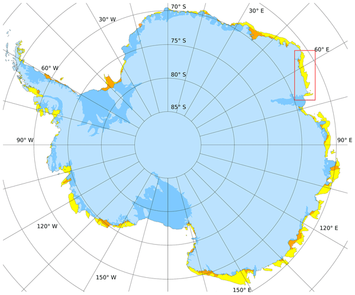

# fast-ice
Matlab functions for loading Alex Fraser's fast ice dataset.

# Contents 

* `fastice_data_download` downloads all 19 years of fast ice data. 
* `fastice_data` loads gridded data for any specified year of the fortnightly fast ice data. 
* `fastice_data_autumn` loads gridded data corresponding to early March of every year (because coastline mapping is only updated once a year, each March). 

# Getting Started
1.  Install [Antarctic Mapping Tools for Matlab](https://github.com/chadagreene/Antarctic-Mapping-Tools). 
2. Get the data. The simplest thing is to run `fastice_data_download`, which will download all the data (It's a big dataset and it takes a while.) If your firewall settings prevent `fastice_data_download` from running, you can manually download the data [here](https://data.aad.gov.au/s3/bucket/datasets/science/AAS_4116_Fraser_fastice_circumantarctic/fastice_v2_2/).

# Citations
If you use this dataset and these functions, please cite them as: 

* Fraser, A.D. and Massom, R. (2020) Circum-Antarctic landfast sea ice extent, 2000-2018, Ver. 2.2, Australian Antarctic Data Centre - [doi:10.26179/5d267d1ceb60c](http://dx.doi.org/doi:10.26179/5d267d1ceb60c) 
* Fraser, A. D., Massom, R. A., Ohshima, K. I., Willmes, S., Kappes, P. J., Cartwright, J., and Porter-Smith, R.: High-resolution mapping of circum-Antarctic landfast sea ice distribution, 2000–2018, Earth Syst. Sci. Data, 12, 2987–2999, [doi:10.5194/essd-12-2987-2020](https://doi.org/10.5194/essd-12-2987-2020). 
* Greene, C. A., Gwyther, D. E., & Blankenship, D. D. (2017). Antarctic Mapping Tools for Matlab. Computers & Geosciences, 104, 151–157. Elsevier BV. [doi:10.1016/j.cageo.2016.08.003](https://doi.org/10.1016/j.cageo.2016.08.003) 
